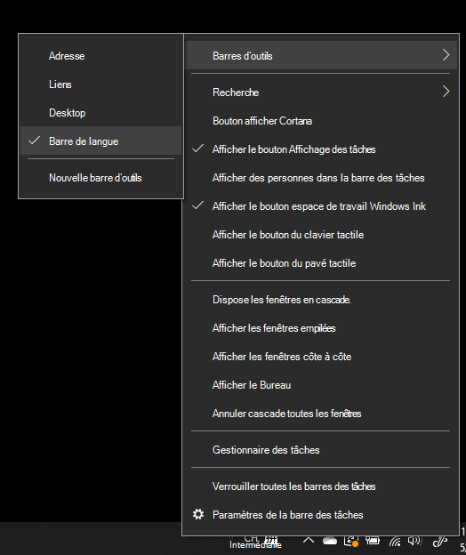

# Masquer, afficher ou réinitialiser la barre de langue

**Pour réduire la barre de langue :**

Vous pouvez cliquer sur le bouton Réduire dans le coin supérieur droit de la barre de langue. Vous pouvez également faire glisser la barre de langue vers la barre des tâches, ce qui permet de la réduire automatiquement.

**Pour ouvrir la barre de langue dans une nouvelle fenêtre :**

Si vous ne voulez pas ancrer la barre de langue dans la barre des tâches, cliquez avec le bouton droit sur un espace vide de la barre des tâches, puis désactivez l’option **Barre de langue** dans le menu Barres d’outils. La barre de langue s’affiche alors en dehors de la barre des tâches, tout comme la capture d’écran précédente.

**Pour restaurer la barre de langue par défaut :**

Cliquez avec le bouton droit sur le bouton de langue dans la barre d’outils, puis cliquez sur l’option **Restaurer la barre de langue** dans le menu. Celle-ci est restaurée par défaut.

