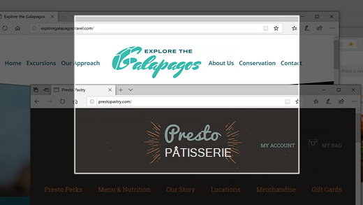
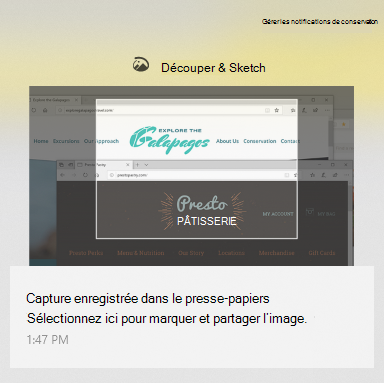

# Utiliser Snip & Sketch pour capturer, marquer et partager des imagesUse Snip & Sketch to capture, mark up, and share images

L'croquis à l'écran s'appelle **désormais & Sketch**.Screen sketch is now called **Snip & Sketch**. **Pour prendre rapidement un snip**:**To quickly take a snip**:

1. Appuyez **sur la touche de logo Windows + Shift + S**. Votre écran s'assombrit et votre curseur s'affiche sous la forme d'une croix.Press the **Windows logo key + Shift + S**. You'll see your screen darken and your cursor displayed as a cross. 

2. Choisissez un point au bord de la zone que vous souhaitez copier, puis cliquez avec le bouton gauche sur le curseur.Choose a point at the edge of the area you want to copy and left-click the cursor. 

3. Déplacez votre curseur pour mettre en surbrillez la zone que vous souhaitez capturer.Move your cursor to highlight the area you want to capture. La zone que vous capturez s'affiche sur votre écran.The area you capture will appear on your screen.

   

L'image que vous avez extraite est enregistrée dans votre Presse-papiers, prête à être pastée dans un e-mail ou un document.The image you snipped is saved to your clipboard, ready for pasting into an email or document. 

**Si vous souhaitez modifier ou afficher l'image**:**If you want to edit or view the image**: 

- Cliquez sur l'icône notifications à l'extrême droite de la barre des tâches ; cliquez ensuite sur l'image que vous avez capturée.Click the notifications icon at the far right side of the taskbar; then click the picture you have just captured. Votre snip s'ouvre dans l'application & Sketch.Your snip opens in the Snip & Sketch app.

   
